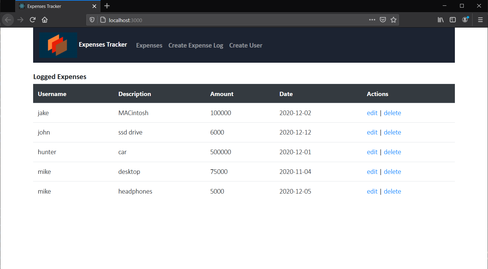

# *Expenses Tracker (MERN)*
 

-----
**Description** \
Web Application to manage a log of your expenses and transactions. Each expense consists of the amount spent, who and what it was spent for and the date of transaction. Expenses can be directly edited or deleted from the log.\
***Built using Node.js for backend and React.js for front end views.\
The data is stored using MongoDB (NoSQL Database).***

-----
**1. Install Dependencies** 
>*npm install express cors mongoose dotenv* \
>*npm install -g nodemon*

>**Bootstrap CSS Framework** \
*npm install bootstrap*

>**Axios Library** \
*npm install axios* 
 
**2. Run Server** 
>*nodemon server* 

**3. Prod** 
>*npm start* \
*Runs the app in development mode.*\
Open [http://localhost:3000](http://localhost:3000) to view it in the browser.

-----
